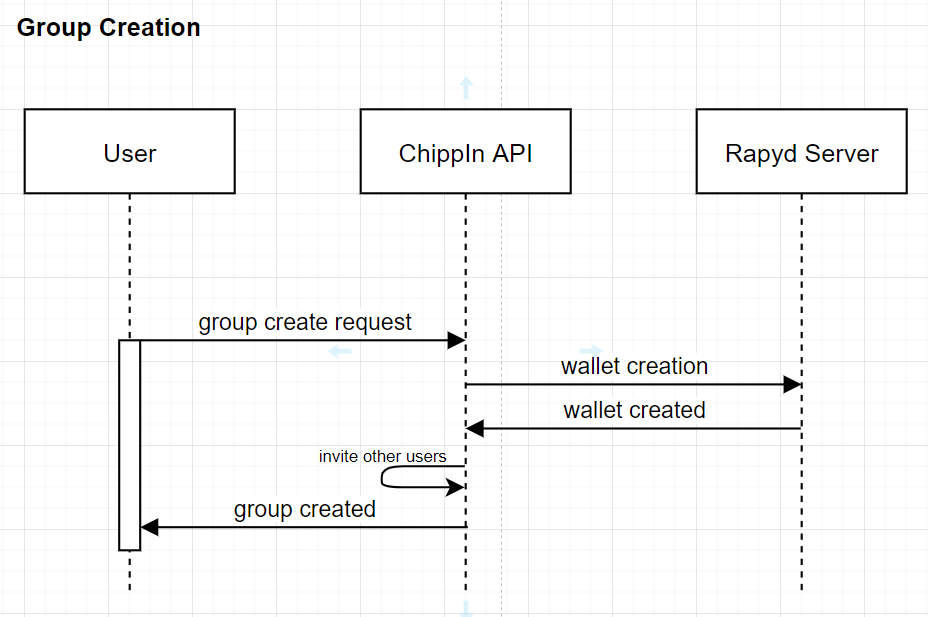
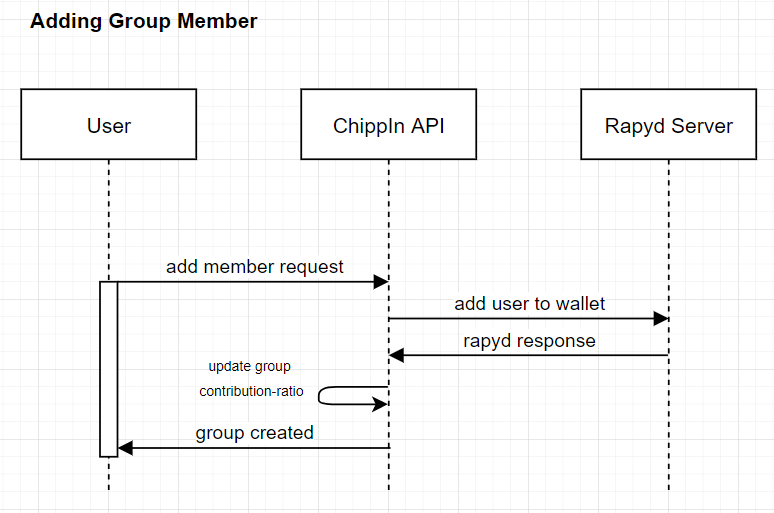
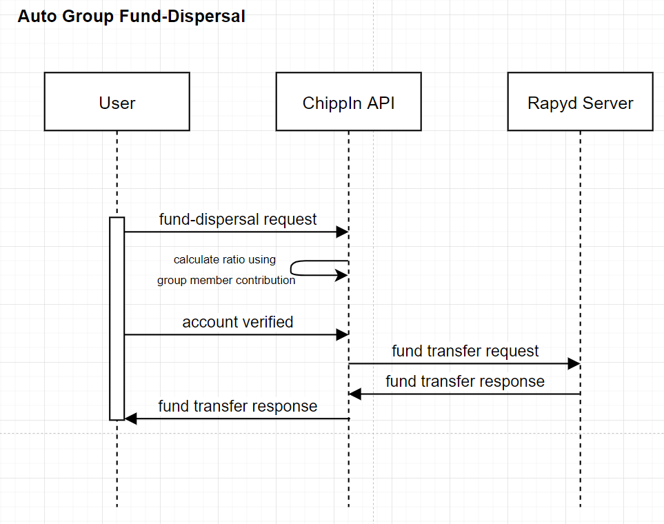

# Chippin Groups - Usage

## Group Registration

  

Groups registration is one tap away following the below events:
1. Users group name and list of users to invite.
2. ChippIn Server creates a new wallet using Rapyd API and adds other users to the group.
3. Users view a new room with options to set upper limit on total contribution.

## Adding users to groups

  

Rapyd API makes it a 2 step process to update group:
1. Users send member details to add in the group.
2. ChippIn Server adds the requested user to the group's wallet using Rapyd API.
3. Group Contribution Ratio is updated.
4. Users view the updates group details and members in response.

## Auto-Funds Dispersal

  

The authentication process is based on OAuth Protocol:
1. Users request auto-fund dispersal request.
2. ChippIn Server calculates the amount to return each group member using contribution ratio.
3. Rapyd API finally receives fund transfer requests from group's wallet to each group member wallet.
4. Users view final updated amount in their personal wallets.