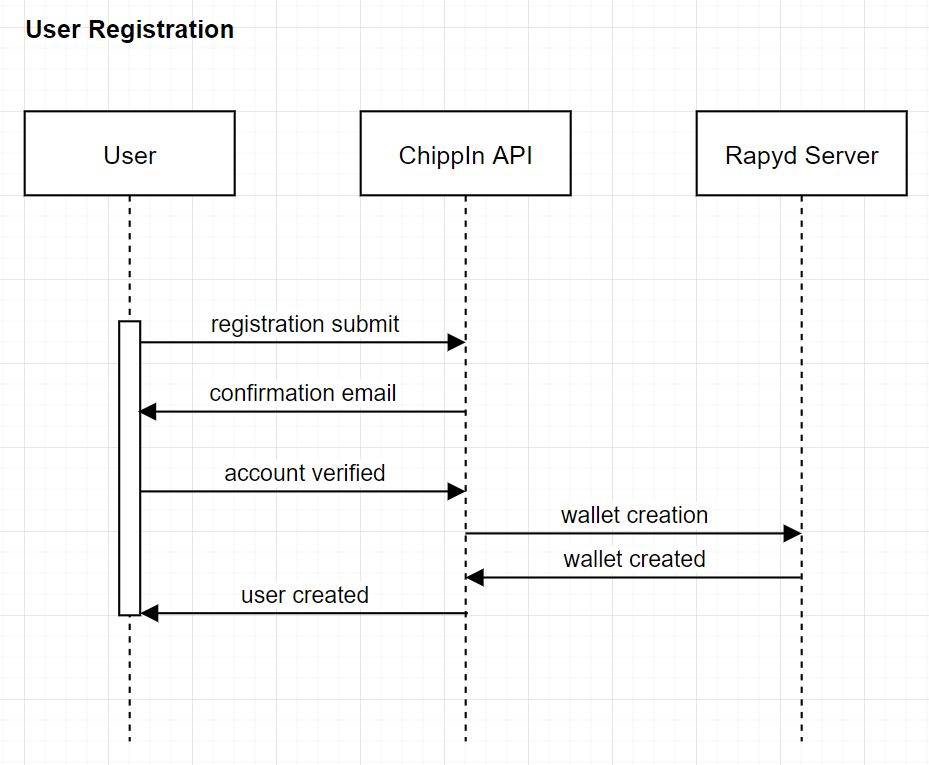
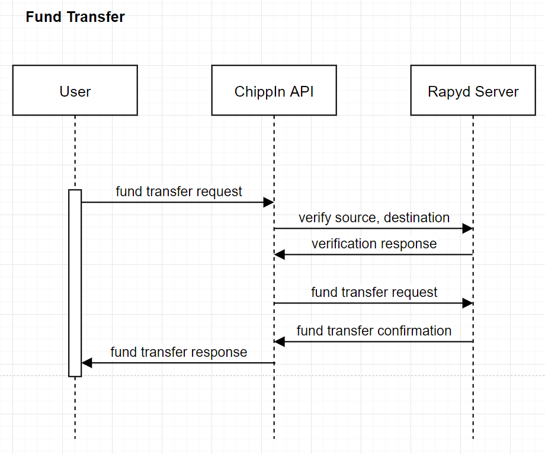

# ChippIn Docs | Users - Usage

## User registration

  

The authentication process is based on OAuth Protocol:
1. Users send name, email and password with registration request to Auth API.
2. ChippIn Server sends email verification link to given email with encrypted token.
3. Users verify account using link in the email.
4. ChippIn creates a new wallet for the user and updates database with user's details.

## Transfering funds between users

  

Fund transfer between users is straight forward using Rapyd API:
1. Users fund transfer request with amount and currency to Wallet API.
2. Source wallet and Destination wallets are verifed.
3. ChippIn Server sends fund transfer request to Rapyd API using Rapyd SDK.
4. Users receive fund transfer status.